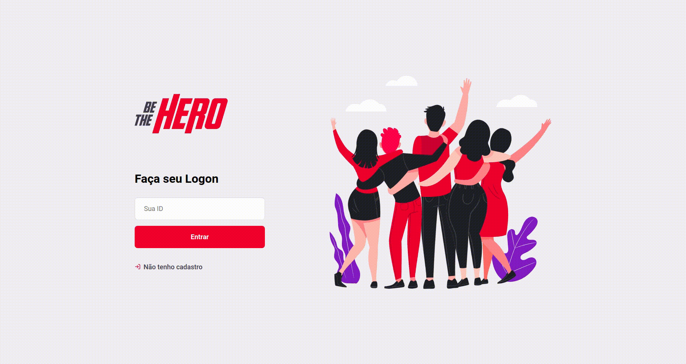

<h1 align="center">
  
</h1>

<h1>
  
</h1>

## :pencil: Sobre

Aplicação desenvolvida na **Semana Omnistack** para que ONG's possam ter ajuda financeira.

Por exemplo, existem ONG's que cuidam de animais de rua e estes necessitam de tratamentos cirúrgicos que a própria ONG não poderá arcar. Há também ONG's que ajudam moradores em vulnerabilidade socioeconômica e dentre outras.

A aplicação realiza o cadastramento das ONG's e permite que estas possam publicar o tipo de ajuda que elas estão precisando.

A plataforma web, é feita apenas para as ONG's, já o **app mobile** permite que usuários visualizem as publicações das ONG's, com título, descrição do caso, contato e localização.

## :art: Tecnologias utilizadas:

**BACK-END**

> - [NodeJS](https://nodejs.org/en/)
> - [Nodemon](https://nodemon.io/)
> - [Express](https://expressjs.com/)
> - [SQLite3](https://www.npmjs.com/package/sqlite3)
> - [Cors](https://www.npmjs.com/package/cors)

**WEB**

> - [ReactJS](https://pt-br.reactjs.org/)
> - [React Router Dom](https://reactrouter.com/web/guides/quick-start)
> - [CSS](https://developer.mozilla.org/pt-BR/docs/Web/CSS)
> - [Axios](https://github.com/axios/axios)

**MOBILE**

> - [Expo](https://expo.io/)
> - [React Native](https://reactnative.dev/)

## :tea: Como baixar o projeto

```bash
  # Clone a pasta do projeto

  $ git clone https://github.com/rodrigues-caio/be-the-hero.git

  # Abra a pasta

  $ cd be-the-hero

  # Abra as pastas uma em cada editor

  $ cd back-end
  $ cd web
  $ cd mobile

  # E rode o comando de sua preferência

  $ yarn or npm install

  # Rode a aplicação em todas as pastas

  $ yarn start or npm start

```
