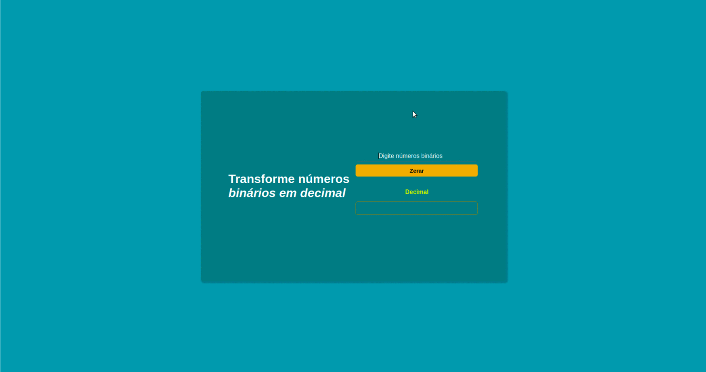

<h1 align="center">
Conversão de binário para decimal
</h1>

<h1>
  
</h1>

## Sobre

Nesta aplicação, foi desenvolvida uma página web para conversão de numeros binários para numeros decimais.

Utilizei o tipo de input 'number' para dificultar a inserção de caracteres no input, recebendo apenas números.

Criei uma lógica para que a entrada de dados fosse apenas 0 e 1, caso o usuário coloque outro número diferente, um erro será disparado.

**OBS:** a conversão ocorre com apenas 8 dígitos binários.

\*Projeto inspirado pelo **_app-ideas_** \*

## Tecnologias utilizadas:

- [HTML](https://developer.mozilla.org/pt-BR/docs/Web/HTML)
- [CSS](https://developer.mozilla.org/pt-BR/docs/Web/CSS)
- [JAVASCRIPT](https://developer.mozilla.org/pt-BR/docs/Web/JavaScript)

## Como baixar o projeto

Para executar o código, é preciso apenas que clone este repositório e abra-o o arquivo 'index.html' em um navegador.

```bash
  # clone o repositório

  $ git clone https://github.com/rodrigues-caio/convertion-binary-to-decimal.git

  # abra o arquivo no seu editor de código

  $ cd convertion-binary-to-decimal

  # agora abra o arquivo index.html para visualizar
```

Desenvolvido por **Caio Rodrigues**
